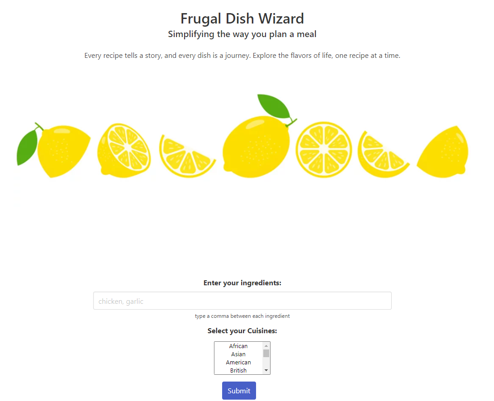

# Frugal Dish Wizard
Frugal Dish Wizard is an HTML/CSS/Javascript meal planning application that allows you to search for meals based on ingredients and cuisine type. Each recipe provides a price per serving to ensure that our customers are able to create meal plans and stay within budget during these trying times.

## Usage
Please follow the link below to begin your meal planning experience:
https://nydiagal.github.io/FrugalDishWizard/
 
 When you input "Chicken, rice" into the search box you will be presented with multiple meal options.
 
 When you select cuisine type you are presented with multiple meal options from that region.
 
 When you input "chicken, rice" and select a cuisine you are presented with multiple meal options from that region
 that includes those ingredients.
 
 When you are presented with your meal options, each card you will have the price per serving to ensure you are able to stay within your budget.

 ## Contributors
 Parker Akin
 Nydia Galvez
 Irania Quiles
 Robert Wright

 
